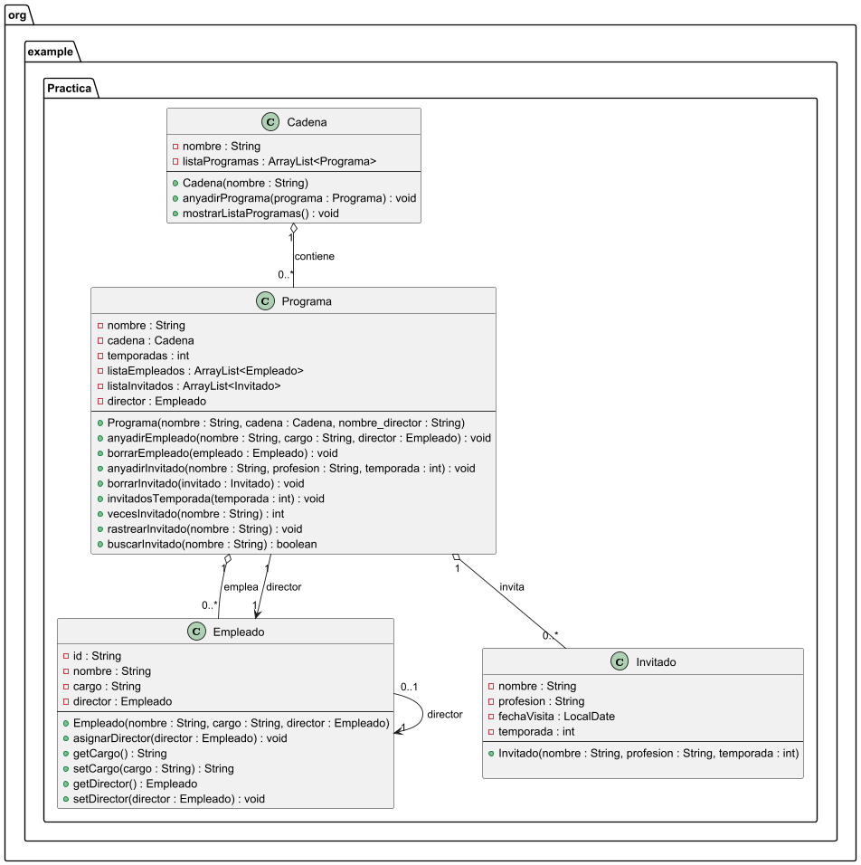
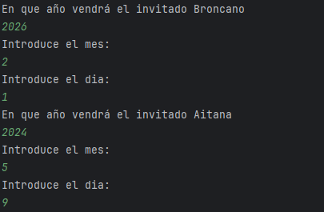
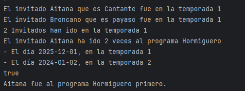

# Práctica 1. El formiguero y la Rebelión

## ÍNDICE 
1. [Intro](https://github.com/adrigeada/programacion_ud5/edit/main/programacion_ud5/src/main/java/org/example/Practica/Documentacion.md#1-intro)
2. [Estructura de clases](#2-estructura-de-clases)
    - [Diagrama de clases UML](#diagrama-de-clases-uml)
    - [Código de PlantUML](#codigo-de-plantuml)
    - [Contenido de las clases .java](#contenido-de-las-clases-java)
3. [Programa principal (app)](#3-programa-principal-app)
4. [Pruebas](#4-pruebas)
5. [Entrega](#5-entrega)

### 1. Intro
> La práctica consiste en una app para crear cadenas de televisión, programas, empleados de los programas y los invitados que irán a estos programas.
> Un programa pertenece a una cadena y una cadena puede tener muchos programas. Los programas tienen empleados e invitados. De los empleados, uno es el director del programa.<br>
> Esta app aplica unos métodos:
> - Para poder elegir la fecha en la que un invitado acudirá al programa.
> - Para ver cuantos invitados han acudido en una temporada dada, de un programa.
> - Cuantas veces ha ido un invitado a una temporada, dado el nombre del invitado.
> - Mostrar que días ha ido el invitado al programa.
> - Saber si un invitado ha estado en un programa.
> - Dado el nombre del invitado y dos programas, saber a que programa fue antes. 

### 2. Estructura de clases

#### Diagrama de clases UML


#### Codigo de PlantUML

````
@startuml

package "org.example.Practica" {

class Cadena {
    - nombre : String
    - listaProgramas : ArrayList<Programa>
    --
    + Cadena(nombre : String)
    + anyadirPrograma(programa : Programa) : void
    + borrarPrograma(programa : Programa) : void
    + mostrarListaProgramas() : void
}

class Programa {
    - nombre : String
    - cadena : Cadena
    - temporadas : int
    - listaEmpleados : ArrayList<Empleado>
    - listaInvitados : ArrayList<Invitado>
    - director : Empleado
    --
    + Programa(nombre : String, cadena : Cadena, nombre_director : String)
    + anyadirEmpleado(nombre : String, cargo : String, director : Empleado) : void
    + borrarEmpleado(empleado : Empleado) : void
    + anyadirInvitado(nombre : String, profesion : String, temporada : int) : void
    + borrarInvitado(invitado : Invitado) : void
    + invitadosTemporada(temporada : int) : void
    + vecesInvitado(nombre : String) : int
    + rastrearInvitado(nombre : String) : void
    + buscarInvitado(nombre : String) : boolean
}

class Empleado {
    - id : String
    - nombre : String
    - cargo : String
    - director : Empleado
    --
    + Empleado(nombre : String, cargo : String, director : Empleado)
    + asignarDirector(director : Empleado) : void
    + getCargo() : String
    + setCargo(cargo : String) : String
    + getDirector() : Empleado
    + setDirector(director : Empleado) : void
}

class Invitado {
    - nombre : String
    - profesion : String
    - fechaVisita : LocalDate
    - temporada : int
    --
    + Invitado(nombre : String, profesion : String, temporada : int)

}

Cadena "1" o-- "0..*" Programa : contiene
Programa "1" o-- "0..*" Empleado : emplea
Programa "1" o-- "0..*" Invitado : invita
Programa "1" --> "1" Empleado : director
Empleado "0..1" --> "1" Empleado : director

}

@enduml

````

#### Contenido de las clases (.java)
- Clase Cadena.java
````
package org.example.Practica;

import java.util.ArrayList;

public class Cadena {
    private String nombre;
    private ArrayList<Programa> listaProgramas;

    public Cadena(String nombre){
        this.nombre = nombre;
        listaProgramas = new ArrayList<>();
    }

    public void anyadirPrograma(Programa programa){
        listaProgramas.add(programa);
    }

    public void borrarPrograma(Programa programa){
        listaProgramas.remove(programa);
    }

    public void mostrarListaProgramas (){
        for (Programa programa : listaProgramas){
            System.out.println("- "+programa);
        }
    }

    public String getNombre() {
        return nombre;
    }

    public void setNombre(String nombre) {
        this.nombre = nombre;
    }

    public ArrayList<Programa> getListaProgramas() {
        return listaProgramas;
    }

    public void setListaProgramas(ArrayList<Programa> listaProgramas) {
        this.listaProgramas = listaProgramas;
    }

    @Override
    public String toString() {
        return "Cadena{" +
                "nombre='" + nombre + '\'' +
                "Lista Programas" + listaProgramas+
                '}';
    }
}

````
[Link a la clase en github](https://github.com/adrigeada/programacion_ud5/blob/main/programacion_ud5/src/main/java/org/example/Practica/Cadena.java)

- Clase Empleado.java
````
package org.example.Practica;

import java.util.Arrays;

/**
 * PRE_ID es el prefijo que se usa al crear los id de los empleados. Se añade al contadorID. El contador se suma cada vez que se crea un empleado
 * CARGO_DIRECTOR se usa para controlar si el empleado añadido es director o no
 * POSIBLES_CARGOS  es un array donde están los cargos aceptados de empleados. Si el cargo no coincide con uno de ellos se les asigna CARGO_DEFAULT
 */
public class Empleado {
    private static final String PRE_ID = "EP";
    private static final String CARGO_DIRECTOR = "director";
    private static final String[] POSIBLES_CARGOS = new String[] {"director", "tecnico", "presentador", "colaborador"};
    private static final String CARGO_DEFAULT = "pte";

    private static int contadorID = 0;

    private String id;
    private String nombre;
    private String cargo;
    private Empleado director;


    public Empleado(String nombre,String cargo,Empleado director){
        ++contadorID;
        id = setId();
        this.nombre = nombre;
        this.cargo = setCargo(cargo);
        asignarDirector(director);
    }


    public void asignarDirector(Empleado director){ //Controla que a un director no se le pueda asginar un director

        if (cargo.equals(CARGO_DIRECTOR)){
            this.director = null;
        }else {
            this.director = director;
        }

    }

    public String getId() {
        return id;
    }

    private static String setId() {
       return PRE_ID+contadorID;
    }

    public String getNombre() {
        return nombre;
    }

    public void setNombre(String nombre) {
        this.nombre = nombre;
    }

    public String getCargo() {
        return cargo;
    }

    public String setCargo(String cargo) {//Controla que el cargo que se ha usado es válido entre la lista de  POSIBLES_CARGOS

        if (Arrays.asList(POSIBLES_CARGOS).contains(cargo)){
            return cargo;
        }else {
            System.out.println("El cargo '"+cargo+"' no es posible. Cargo por defecto usado.");
            return CARGO_DEFAULT;
        }

    }

    public Empleado getDirector() {
        return director;
    }

    public void setDirector(Empleado director) {
        this.director = director;
    }

    @Override
    public String toString() {
        return "Empleado{" +
                "id='" + id + '\'' +
                ", nombre='" + nombre + '\'' +
                ", cargo='" + cargo + '\'' +
                ", director=" + director +
                '}';
    }
}

````
[Link a la clase en github](https://github.com/adrigeada/programacion_ud5/blob/main/programacion_ud5/src/main/java/org/example/Practica/Empleado.java)

- Clase Invitado.java
````
package org.example.Practica;

import java.time.LocalDate;
import java.util.Scanner;

public class Invitado {
    static Scanner teclado = new Scanner(System.in);

    private String nombre;
    private String profesion;
    private LocalDate fechaVisita;
    private int temporada;


    public Invitado (String nombre,String profesion,int temporada){
        this.nombre = nombre;
        this.profesion = profesion;
        setFechaVisita();
        this.temporada = temporada;
    }

    public String getNombre() {
        return nombre;
    }

    public void setNombre(String nombre) {
        this.nombre = nombre;
    }

    public String getProfesion() {
        return profesion;
    }

    public void setProfesion(String profesion) {
        this.profesion = profesion;
    }

    public LocalDate getFechaVisita() {
        return fechaVisita;
    }

    /*
    Este método se usa para que el usuario introduzca por teclado la fecha en la que el invitado fue al programa. El año, mes y dia se guardan en variables int que luego se usan para crear la variable LocalDate
     */
    public void setFechaVisita() {
        System.out.println("En que año vendrá el invitado "+nombre);
        int anyo = teclado.nextInt();
        System.out.println("Introduce el mes: ");
        int mes = teclado.nextInt();
        System.out.println("Introduce el dia: ");
        int dia = teclado.nextInt();

        LocalDate fecha = LocalDate.of(anyo,mes,dia);
        fechaVisita = fecha;
    }

    public int getTemporada() {
        return temporada;
    }

    public void setTemporada(int temporada) {
        this.temporada = temporada;
    }

    @Override
    public String toString() {
        return "Invitado{" +
                "nombre='" + nombre + '\'' +
                ", profesion='" + profesion + '\'' +
                ", fechaVisita=" + fechaVisita +
                ", temporada=" + temporada +
                '}';
    }
}

````
[Link a la clase en github](https://github.com/adrigeada/programacion_ud5/blob/main/programacion_ud5/src/main/java/org/example/Practica/Invitado.java)

- Clase Programa.java
````
package org.example.Practica;

import java.util.ArrayList;

public class Programa {
    private static final String CARGO_DIRECTOR = "director";

    private String nombre;
    private Cadena cadena;
    private int temporadas;
    private ArrayList<Empleado> listaEmpleados;
    private ArrayList<Invitado> listaInvitados;
    private Empleado director;

    public Programa(String nombre,Cadena cadena,String nombre_director){
        this.nombre = nombre;
        this.cadena = cadena;
        this.temporadas = 0;
        listaEmpleados = new ArrayList<>();
        listaInvitados = new ArrayList<>();
        setDirector(nombre_director);
        cadena.anyadirPrograma(this); //Cuando se crea el programa se añade a si mismo a su cadena.
    }


    //------------------------------------------------

    /*
    Este método crea empleados dentro de un programa. Si el cargo de este es director, no lo deja crear, porque el director se crea en Programa. Luego se añaden a la lista de empleados.
     */
    public void anyadirEmpleado(String nombre, String cargo){
        Empleado empleado = new Empleado(nombre,cargo,getDirector());
        if (cargo.equals(CARGO_DIRECTOR)){
            System.out.println("El programa ya tiene director.");
            return;
        }

        listaEmpleados.add(empleado);
    }

    public void borrarEmpleado(Empleado empleado){
        listaEmpleados.remove(empleado);
    }

   /*
   Este método crea invitados y los añade a la lista de invitados
    */
    public void anyadirInvitado(String nombre,String profesion,int temporada){
        Invitado invitado = new Invitado(nombre,profesion,temporada);
        listaInvitados.add(invitado);
    }

    public void borrarInvitado(Invitado invitado){
        listaInvitados.remove(invitado);
    }

    /*
    Dada una temporada, este metodo cuenta cuantos invitados han asistido a esta temporada y los enseña
     */
    public void invitadosTemporada(int temporada){
        int contador = 0;

        for (Invitado invitado : listaInvitados){
            if (invitado.getTemporada() == temporada){
                contador++;
                System.out.println("El invitado "+invitado.getNombre()+ " que es "+invitado.getProfesion()+" fue en la temporada "+temporada);
            }
        }

        System.out.println(contador+" Invitados han ido en la temporada "+temporada );

    }

    /*
    Dado un nombre de un invitado, este método cuenta cuantas veces ha estado este invitado en un programa. Lo devuelve en un int.
     */
    public int vecesInvitado(String nombre){
        int contador = 0;

        for (Invitado invitado : listaInvitados){
            if (invitado.getNombre().equals(nombre)){
                contador++;
            }
        }
        return contador;
    }

    /*
    Dado el nombre de un invitado, este método enseña que días estuvo en el programa
     */
    public void rastrearInvitado(String nombre){
        int veces = vecesInvitado(nombre);
        System.out.println("El invitado "+nombre+" ha ido "+veces+" veces al programa "+this.nombre);

        for (Invitado invitado : listaInvitados){
            if (invitado.getNombre().equals(nombre)){
                System.out.println("- El día "+invitado.getFechaVisita()+", en la temporada "+invitado.getTemporada());
            }

        }
    }

    /*
    Dado un nombre de un invitado, este método comprueba si el invitado ha ido al programa. Devuelve un booleano
     */
    public boolean buscarInvitado(String nombre){
        for (Invitado invitado : listaInvitados){
            if (invitado.getNombre().equals(nombre)){
                return true;
            }
        }
        return false;
    }


    //--------------------------------------------------------------------------

    public String getNombre() {
        return nombre;
    }

    public void setNombre(String nombre) {
        this.nombre = nombre;
    }

    public Cadena getCadena() {
        return cadena;
    }

    public void setCadena(Cadena cadena) {
        this.cadena = cadena;
    }

    public int getTemporadas() {
        return temporadas;
    }

    public void setTemporadas(int temporadas) {
        this.temporadas = temporadas;
    }

    public ArrayList<Empleado> getListaEmpleados() {
        return listaEmpleados;
    }

    public void setListaEmpleados(ArrayList<Empleado> listaEmpleados) {
        this.listaEmpleados = listaEmpleados;
    }

    public ArrayList<Invitado> getListaInvitados() {
        return listaInvitados;
    }

    public void setListaInvitados(ArrayList<Invitado> listaInvitados) {
        this.listaInvitados = listaInvitados;
    }

    public Empleado getDirector() {
        return director;
    }

    /*
    Cuando se crea el programa, se crea tambien el director que es un empleado que siempre va a tener el cargo "director", por eso se una CARGO_DIRECTOR
     */
    public void setDirector(String nombre) {
        Empleado director = new Empleado(nombre,CARGO_DIRECTOR,null);
        this.director = director;
        listaEmpleados.add(director);
    }

    // -------------------------------------------------------------


    @Override
    public String toString() {
        return "Programa{" +
                "nombre='" + nombre + '\'' +
                ", cadena=" + cadena.getNombre() +
                ", temporadas=" + temporadas +
                ", director=" + director +
                ", Lista empleados= " + listaEmpleados +
                '}';
    }
}

````
[Link a la clase en github](https://github.com/adrigeada/programacion_ud5/blob/main/programacion_ud5/src/main/java/org/example/Practica/Programa.java)


### 3. Programa principal (app)
````
package org.example.Practica;

import java.time.LocalDate;

public class AppProgramas {
    static void main() {

        Cadena antena3 = new Cadena("Antena 3");
        System.out.println(antena3);
        Programa hormiguero = new Programa("Hormiguero",antena3,"Director1");
        Programa revuelta = new Programa("Revuelta",antena3,"Ricardo");
        System.out.println(antena3);

        hormiguero.anyadirEmpleado("Pablito","presentador");
        hormiguero.anyadirEmpleado("Paco","director");
        hormiguero.anyadirEmpleado("Vicen","programador");
        System.out.println(hormiguero);

       hormiguero.anyadirInvitado("Aitana","Cantante",1);
       hormiguero.anyadirInvitado("Aitana","Comico",2);
       hormiguero.anyadirInvitado("Broncano","payaso", 1);
       revuelta.anyadirInvitado("Aitana","Cantante",1);

       hormiguero.invitadosTemporada(1);
       hormiguero.rastrearInvitado("Aitana");

       if (hormiguero.buscarInvitado("Aitana") && revuelta.buscarInvitado("Aitana")){
           invitadoAntes("Aitana",hormiguero,revuelta);
       }

        System.out.println(hormiguero.getListaInvitados());

    }

    /*
    Este metodo recive el nombre de un invitado y dos programas. Entonces encuentra la fecha en la que fue a los programas y las compara. Luego te dice a que programa fue primero.
     */
    public static void invitadoAntes (String nombre,Programa programa1, Programa programa2){

        LocalDate fecha1 = null;
        LocalDate fecha2 = null;

        for (Invitado invitado : programa1.getListaInvitados()){
            if (invitado.getNombre().equals(nombre)){
                fecha1 = invitado.getFechaVisita();
            }
        }

        for (Invitado invitado : programa2.getListaInvitados()){
            if (invitado.getNombre().equals(nombre)){
                fecha2 = invitado.getFechaVisita();
            }
        }

        if (fecha1.isBefore(fecha2)){
            System.out.println(nombre+" fue al programa "+programa1.getNombre()+" primero.");
        }else {
            System.out.println(nombre+" fue al programa "+programa2.getNombre()+ " primero.");
        }

    }
}

````
[Link a la clase en github](https://github.com/adrigeada/programacion_ud5/blob/main/programacion_ud5/src/main/java/org/example/Practica/AppProgramas.java)

### 4. Pruebas
> Para esta prueba creo una Cadena llamada Antena 3. Y la he impreso.
> Luego he creado dos programas, El Hormiguero y la revuelta, en la Cadena Antena 3 y he vuelto a imprimir la Cadena. Este es el resultado:
````
Cadena{nombre='Antena 3'Lista Programas[]}
Cadena{nombre='Antena 3'Lista Programas[Programa{nombre='Hormiguero', cadena=Antena 3, temporadas=0, director=Empleado{id='EP1', nombre='Director1', cargo='director', director=null}, Lista empleados= [Empleado{id='EP1', nombre='Director1', cargo='director', director=null}]}, Programa{nombre='Revuelta', cadena=Antena 3, temporadas=0, director=Empleado{id='EP2', nombre='Ricardo', cargo='director', director=null}, Lista empleados= [Empleado{id='EP2', nombre='Ricardo', cargo='director', director=null}]}]}
````
<br>

> Luego he añadido 3 empleados al programa Hormiguero. Un presentador que se añade sin problema. Un director que no se añade ya que ya hay un director existente. Y un programador que se añade pero se le cambia el cargo al cargo por defecto pte, ya que el cargo programador no entra dentro de los parametros permitidos. Luego he impreso el programa hormiguero. Este es el resultado:
````
El programa ya tiene director.
El cargo 'programador' no es posible. Cargo por defecto usado.
Programa{nombre='Hormiguero', cadena=Antena 3, temporadas=0, director=Empleado{id='EP1', nombre='Director1', cargo='director', director=null}, Lista empleados= [Empleado{id='EP1', nombre='Director1', cargo='director', director=null}, Empleado{id='EP3', nombre='Pablito', cargo='presentador', director=Empleado{id='EP1', nombre='Director1', cargo='director', director=null}}, Empleado{id='EP5', nombre='Vicen', cargo='pte', director=Empleado{id='EP1', nombre='Director1', cargo='director', director=null}}]}
````
<br>

> En el siguiente paso añado los invitados. Ya que el setFechaVisita de Invitado te pide el año, mes y día en el que el invitado hizo la visita, eso es lo que vemos por pantalla: <br>
 <br><br>
> Después uso el método para ver cuantos invitados han ido a la temporada 1. El método para ver qué días ha ido Aitana al hormiguero. Y el método para ver a que programa fue Aitana primero entre El Hormiguero y la Revuelta. Este es el resultado de esos tres métodos:<br>
<br><br>
> Finalmente imprimo la lista de invitados que han ido al hormiguero. Este es el resultado:
````
[Invitado{nombre='Aitana', profesion='Cantante', fechaVisita=2025-12-01, temporada=1}, Invitado{nombre='Aitana', profesion='Comico', fechaVisita=2024-01-02, temporada=2}, Invitado{nombre='Broncano', profesion='payaso', fechaVisita=2026-02-01, temporada=1}]
````


### 5. Entrega

- [X] Código fuente en GitHub
- [X] Documentación
